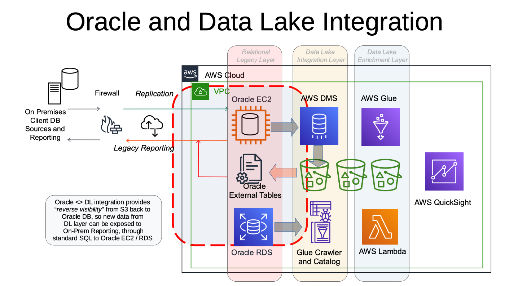

<h1>DL2DB: ORACLE AND S3 DATA LAKE INTEGRATION</h1>

# Integrate data from Amazon S3 Data Lake into Relational Databases
This blueprint contains components that can be used to accelerate deployment
of Data Lake solutions on AWS. The blueprint deploys Oracle Database "native"
tools to facilitate _real time_ data exchange with S3 Data Lake.

## Architecture Overview
The following diagram presents the architecture of the blueprint.

This approach simplifies the deployment and increases "tools transparency" of
AWS Data Lake. To make it more effective, the resulting "integrated" data set
is fully transparent for on premises consumers and is accessible via familiar
Oracle SQL language and already deployed tools, scripts and dashboards.

## Architecture Components
The integration components retreive data from the source "Raw" Data Lake S3 layer
in multiple formats, including CSV and Parquet, and make it accessible online
through Oracle Database kernel processing, transparent for the end user and
searcheable by SQL - meaning on premises Business Analysts and Data Scientists
may apply without changes any existing reports or scripts for robust analysis
and dashboards for charting.

The following main parts of the blueprint are marked with red dashed line on the
solution diagram.

1. **Oracle EC2 Database component** - This component leverages the
[DBMS_CLOUD](./run2.sql) package to extract the metadata of CSV Data Set (NYC
Cabs Trips data) and makes it available to Oracle RDBMS kernel for real time
processing. To reduce compute expenses this repository includes a small subset of
original data. The user may simply overwrite existing shortened CSV file by
[full 566MB data set](https://www1.nyc.gov/site/tlc/about/tlc-trip-record-data.page). 
(The direct S3 link to CSV file is printed by deployment script).

2. **AWS S3 bucket** - This is a standard component of any Data Lake,
accessible via "https" URI.

3. **Oracle External Table component** - This entity simplifies the deployment
   and increases "tools transparency" of AWS Data Lakes, allowing effective
aggregation of Relational and Non-Relational data and its processing, including
popular Oracle features as Parallel Execution.

4. **Account** - Identify an Account which will be used to deploy the database
and S3 objects. The subnets in the Account VPC need to have outbound
connectivity to the internet as well as properly configured "_default_"
Security Group, allowing your local computer IP limited network access to the
environment on ports TCP 22 and TCP 1521. The process will require you to run
sequentially three "Run" scripts - one Python and two SQLs, assuming that you
have _Python 3.6+_ and any _SQL Editor_ installed.

5. **IAM Role and User** - to proceed to deployment, you need to create IAM
Role with Administrator privileges and grant it to IAM User. Extract that
user's credentials and use them to configure your local AWS CLI client, as
well as entering them into "run2.sql" script.

## Deployment

Usually, you would want to create a new AWS account for these excercises.
In there, add the IAM user - member of "AdministratorAccess" IAM group - and
record its credentials.

Deploy a Linux EC2 instance - that will serve as your "cloud workstation", to avoid
unnecessary complications with IP-related restrictions in security groups. 
(All VMs here will be deployed into "_default_" Security Group.)
Of course, if you feel confident - we encourage you to set up these scripts to
run from your actual Mac or Linux laptop. As of now this deployment sequence
will _not_ work on Windows.

Log into the EC2 instance (from now on referred to as "_Workstation_") and set up AWS
CLI access with previously saved credentials of new IAM Admin user.

It _is_ important: the deployment scripts _assumes_ you have 
[fully working AWS CLI client](https://docs.aws.amazon.com/cli/latest/userguide/cli-chap-install.html)
 and Python SDK installed and configured on your machine. Usually
this is done by running _"pip install boto3 awscli"_, followed by _"aws
configure"_. The end goal is to execute _"aws s3 ls"_ without errors.

__NOTE:__ Before attempting the deployment, please store the _"oracle.pem"_
ssh key into your _"~" home_ directory. For security reasons this file is _not_
part of this repository and will be provided to you by your AWS contact.

To deploy this blueprint, execute _"run1.py"_ script.
The following is a log of successful deployment session.

__WARNING:__ This deployment will incur standard run-time charges to your AWS
account! Do not attempt to deploy this solution if charges are not acceptable.

<pre><code>
[u1@fed dl_to_db]$ ./run1.py
===
... running as user aidayc2q6y2eflhctx7wh
... using S3 bucket s3-aidayc2q6y2eflhctx7wh in us-east-2
... Full 566MB data set: https://s3.amazonaws.com/nyc-tlc/trip+data/yellow_tripdata_2020-01.csv
... You can download it and overwrite this short version.
... storing file yellow_tripdata_2020-01.csv, please wait ...
... launching OUL VM oul-aidayc2q6y2eflhctx7wh in us-east-2
... deploying AMI ami-xxxxxxxxxxxxxxxxx, please wait ...
... (Sun Aug  8 13:00:31 2021) waiting 2 min before contacting oul-aidayc2q6y2eflhctx7wh on us-east-2
... launched Instance oul-aidayc2q6y2eflhctx7wh (10.21.17.13) in us-east-2
Warning: Permanently added '10.21.17.13' (ED25519) to the list of known hosts.
Linux oul 5.4.17-2102.203.6.el8uek.x86_64 #2 SMP Wed Jul 21 17:45:32 PDT 2021 GNU/Linux
listener.ora                                                         100%  189     0.3KB/s   00:00
tnsnames.ora                                                         100%  264     0.7KB/s   00:00
s.sh                                                                 100%  446     0.5KB/s   00:00
TNSLSNR for Linux: Version 19.0.0.0.0 - Production
System parameter file is
/opt/oracle/product/19c/dbhome_1/network/admin/listener.ora
Log messages written to /opt/oracle/diag/tnslsnr/oul/listener/alert/log.xml
Listening on:
(DESCRIPTION=(ADDRESS=(PROTOCOL=tcp)(HOST=172.31.34.167)(PORT=1521)))
Listening on: (DESCRIPTION=(ADDRESS=(PROTOCOL=ipc)(KEY=EXTPROC1521)))

Connecting to
(DESCRIPTION=(ADDRESS=(PROTOCOL=TCP)(HOST=172.31.34.167)(PORT=1521)))
STATUS of the LISTENER
------------------------
Alias                     LISTENER
Version                   TNSLSNR for Linux: Version 19.0.0.0.0 - Production
Start Date                06-AUG-2021 08:16:09
Uptime                    0 days 0 hr. 0 min. 3 sec
Trace Level               off
Security                  ON: Local OS Authentication
SNMP                      OFF
Listener Parameter File
/opt/oracle/product/19c/dbhome_1/network/admin/listener.ora
Listener Log File         /opt/oracle/diag/tnslsnr/oul/listener/alert/log.xml
Listening Endpoints Summary...
  (DESCRIPTION=(ADDRESS=(PROTOCOL=tcp)(HOST=172.31.34.167)(PORT=1521)))
  (DESCRIPTION=(ADDRESS=(PROTOCOL=ipc)(KEY=EXTPROC1521)))
The listener supports no services
The command completed successfully
ORACLE instance started.

Total System Global Area 4949277248 bytes
Fixed Size        9144896 bytes
Variable Size    1056964608 bytes
Database Buffers   3875536896 bytes
Redo Buffers        7630848 bytes
Database mounted.
Database opened.
USER is "DD"

CONID     3

CONNAME   DDPDB
=== End. Connect with SQL tool to oul-aidayc2q6y2eflhctx7wh (10.21.17.13)
in us-east-2 and run SQL scripts in sequential order.
[u1@fed dl_to_db]$
</pre></code>

6. **Execute SQL**  - the last step is to connect to your newly created Oracle
database with your favourite SQL Tool and to execute SQL scripts (_run2.sql,
run3.sql_). Do not forget to copy and paste _your AWS IAM User credentials_ from
_"~/.aws/credentials"_ and _name of your S3 bucket_ to the body of "run2.sql" script.

7. **Explore**  - from this moment on you may let your imagination go wild,
running any creative SQL reports you wish. As mentioned before, to see the
full data set just upload 566MB CSV to newly created S3 bucket, replacing the
smaller version there. Do not change the name of the file!  

The SQL statements in "_run3.sql_" file provide a starting point - you may find
out what was the average tip amount in January 2020!
